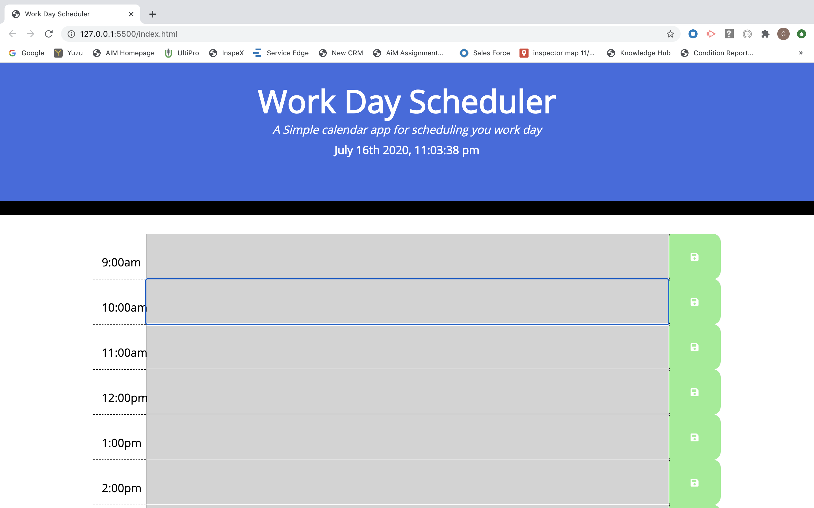

# work-day-scheduler

Work Day Scheduler

I wanted to create a calendar application that will run in a browser that  will allow the user to save events for each hour of the day. This app will feature dynamically updated HTML and CSS powered by jQuery.

This is a simple calendar application that allows the user to save events for each hour of the day. Each timeblock is color coordinated to indicate whether it is the past, present, or future. The text input for that event is saved in local storage, when the save button for each timeblock is triggered by the user. I want the user to add important events to the daily planner, so they can manage their time more effectively.

